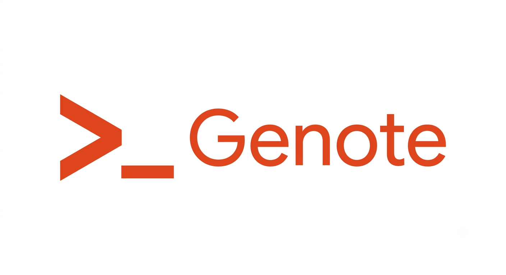

<p align="center">
  
</p>

<h1 align="center">Genote</h1>

<p align="center">
  <a href="https://github.com/xmb03/Genote/releases"></a>
  <a href="https://github.com/xmb03/Genote/commits"></a>
  <a href="https://github.com/xmb03/Genote"></a>
  <a href="https://github.com/xmb03/Genote"></a>
  <br>
  <a href="LICENSE"></a>
  
  <a href="https://github.com/xmb03/Genote/actions"></a>
</p>

<p align="center">
  Generate IT study notes using local LLMs via Ollama.<br>
  Feed it a topic and a few example notes — it writes a new one in your style.
</p>

---

## Features

- **Multi-topic batch** — generate several notes at once: `genote "Rust" "Go" "Python"`
- **Style learning** — reads your existing `.md` notes and mimics their structure (headings, lists, code blocks)
- **Covered-topics restriction** — limit the model to concepts you've already studied (`use_covered_topics = true`)
- **Hints** — pass extra instructions per topic via `(hint)` syntax without affecting the filename: `genote "Closures (skip FnOnce)"`
- **Profiles** — define multiple environments (work/home/server) and switch via `--profile`
- **CLI overrides** — every config option can be overridden inline: `-s big -l ru`
- **Language control** — generate notes in any language (`en`, `ru`, etc.)
- **Size control** — `small` (15–30 lines) or `big` (comprehensive)
- **Progress & timing** — see `[2/3] Sending request…` + elapsed time and token count per note
- **Graceful error handling** — one topic failing doesn't stop the rest of the batch
- **`~` expansion** — use `~/notes` in paths, home dir is resolved automatically
- **Config lookup** — `config.toml` is searched next to the binary first, then in CWD
- **Filename sanitization** — spaces and slashes in topic names become underscores
- **Smart example selection** — reads up to `notes_count` (default 7) example `.md` files, ignores non-`.md` files

## Demo


## How it works

Genote reads your existing `.md` notes from a directory, sends them as style examples to an Ollama model, and generates a new note on the topic you specify. The more example notes you have, the better it matches your writing style.

When `use_covered_topics = true`, genote collects the filenames of your existing notes and tells the model to only use concepts from those covered topics. This prevents the model from introducing material you haven't studied yet.

## Prerequisites

- [Ollama](https://ollama.ai) running locally (or remotely)
- A model pulled in Ollama (e.g. `gemma`, `llama3`, `mistral`)

## Installation

### From source

Requires [Rust](https://rustup.rs).

```bash
git clone https://github.com/xmb03/Genote.git
cd Genote
cargo build --release
```

The binary will be at `target/release/genote`.

### Binary download

Grab the latest binary from the [Releases page](https://github.com/xmb03/Genote/releases).

```bash
curl -L https://github.com/xmb03/Genote/releases/latest/download/genote-linux-x86_64.tar.gz | tar xz
sudo mv genote /usr/local/bin/
```

## Setup

Copy the example config and adjust it to your environment:

```bash
cp config.toml.example config.toml
```

Edit `config.toml`.

### Flat config (simple)

All fields at the root level:

| Field | Description |
|---|---|
| `model` | The Ollama model to use (e.g. `gemma3`, `llama3`) |
| `api_url` | Your Ollama API endpoint |
| `notes_dir` | Directory containing your existing `.md` notes |
| `lang` | Language for the generated note (`en`, `ru`, etc.) |
| `note_size` | `small` for 15–30 lines or `big` for comprehensive |
| `notes_count` | How many example notes to use (default 7) |
| `use_covered_topics` | `true` — the model uses only concepts from existing note filenames. Default `false` |

### Profiles (multiple environments)

Define multiple profiles in `config.toml` and switch between them with `--profile`. Global root fields serve as defaults for all profiles. Profile fields override them. CLI flags override everything.

```toml
default = "work"

# global defaults applied to every profile
model = "llama3"
api_url = "http://127.0.0.1:11434/api/generate"
lang = "en"

[profile.work]
notes_dir = "~/work-notes"
note_size = "big"
notes_count = 10
use_covered_topics = true

[profile.home]
notes_dir = "~/personal-notes"
note_size = "small"
notes_count = 5
model = "mistral"
use_covered_topics = false
```

```bash
# uses default profile ("work")
genote "Rust ownership"

# switch to home profile
genote --profile home "Async Rust"
```

You need at least one `.md` file in your notes directory for genote to learn your writing style.

### Config lookup order

1. Next to the binary (`target/release/config.toml`)
2. Current working directory (`./config.toml`)

## Usage

```bash
# basic usage — all settings from config.toml
genote "Rust ownership and borrowing"

# multiple notes in one command
genote "Rust Ownership" "Borrow Checker" "Smart Pointers"

# override size and language inline
genote -s big -l en "Rust ownership"

# pass extra instructions to the model — not included in filename
genote "Borrow checker (only &mut, skip &)"

# each topic independently supports hints
genote "Closures (skip FnOnce)" "Lifetimes (only elision)" "Generics (no traits)"

# disable covered-topics restriction for this run
genote --use-covered-topics=false "Async Rust"

# use fewer style examples
genote -n 3 "Pattern matching"
```

The generated note appears as a new `.md` file in your notes directory. Spaces and slashes in the topic name are replaced with underscores (e.g. `Rust Ownership` → `Rust_Ownership.md`).

During generation you'll see progress indicators and timing:

```
[1/3] Sending request (Model: llama3, Topic: "Borrow Checker", style examples: 5)…
  Took 4231 ms, generated tokens: 342
[2/3] Sending request (Model: llama3, Topic: "Smart Pointers", style examples: 5)…
  Took 5210 ms, generated tokens: 487
```

If one topic fails (network error, empty response, etc.), the rest continue unaffected.

### All CLI flags

Every config option can be overridden via the command line:

| Flag | Overrides |
|---|---|
| `-m`, `--model <name>` | `model` |
| `--api-url <url>` | `api_url` |
| `-d`, `--notes-dir <dir>` | `notes_dir` |
| `-l`, `--lang <lang>` | `lang` |
| `-s`, `--note-size <size>` | `note_size` |
| `-n`, `--notes-count <n>` | `notes_count` |
| `--use-covered-topics <bool>` | `use_covered_topics` |
| `--profile <name>` | profile selection |

```bash
genote --help
```

## License

MIT
